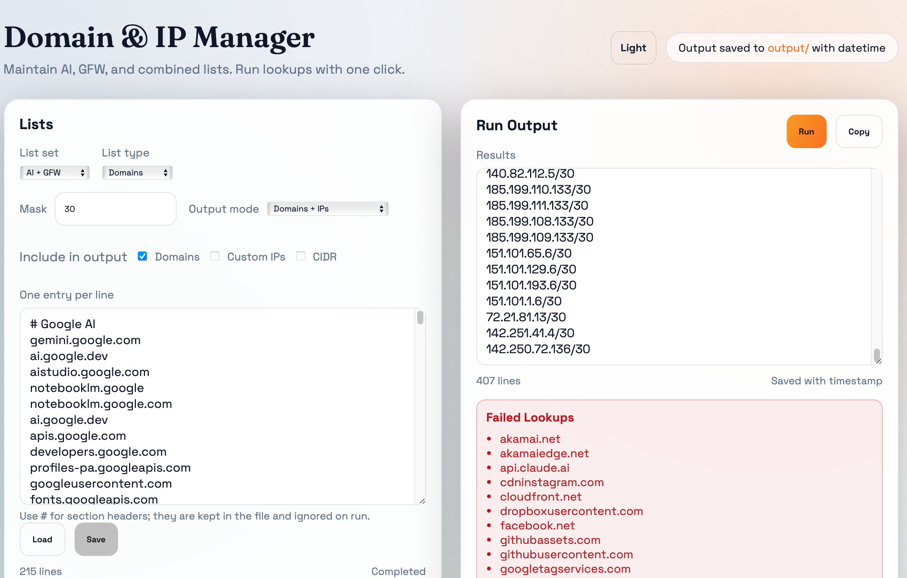

# DomainAndIpManager

Manage domain/IP lists for AI and GFW contexts, run DNS lookups, and export timestamped outputs. Includes CLI scripts and a GUI editor.

## Quick Start (GUI)
```bash
./start_gui.sh
```
Open `http://127.0.0.1:5000`.

## Demo


## CLI Usage
```bash
python3 code/nslookup_simplified.py
python3 code/nslookup_simplified_gfw.py
python3 code/nslookup_simplified_gfw_w_ai.py
python3 code/nslookup_simplified_gfw_wo_ai.py
python3 code/nslookup.py
```
Each script prints results to the terminal and writes `output/<script>_YYYYMMDD_HHMMSS.txt`.

## Data Files
Lists are line-delimited and stored under `data/`:
- `ai_*` for AI-only lists
- `gfw_*` for GFW lists
- `ai_gfw_*` for combined lists
- `gfw_wo_ai_*` for GFW without AI
- `non_gfw_*` for China-accessible (non-GFW) lists
- `default_*` for the legacy/default list

Example:
```
data/ai_domains.txt
data/ai_custom_ips.txt
data/ai_cidr.txt
data/ai_mask.txt
```

## Outputs
- GUI + CLI: `output/<script or gui>_YYYYMMDD_HHMMSS.txt`
- Sorting tools: `output/domain_and_ips_unique_sorted.txt` and `.json`

## Dependencies
```bash
pip install -r requirements.txt
```

## Notes
- One entry per line in data files.
- `*_mask.txt` controls CIDR mask (default is `32`, `default` list uses `24`).
